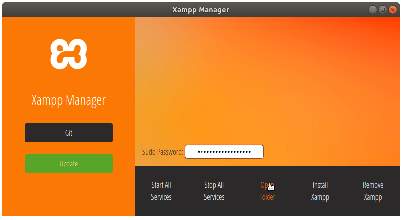

<h3>Xampp Manager</h3>
<h4>it only works for linux. at least for now</h4>

<h3>Screenshots</h3>

<h3>Installing (for GNU+Linux)</h3>
<ul>
<li>git clone https://github.com/anilademyener/xampp-manager</li>
<li>./build-linux.py</li>
<li>./xampp-manager</li>
</ul>

<h2>Windows is not supported!</h2>
<h3>still with nw.exe you can run gui</h3>
